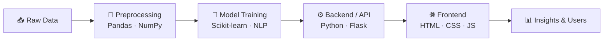

<!-- ═══════════════════════ HEADER ═══════════════════════ -->
<p align="center">
  
</p>

<p align="center">
  <a href="https://git.io/typing-svg">
    
  </a>
</p>

<p align="center">
  
  
  
</p>

---

## 🧠 `model.summary()`

```python
class BharathKrishnan(AIDeveloper):
    """
    A CSE undergrad who turns data into intelligent, real-world applications.
    """

    def __init__(self):
        self.name        = "Bharath Krishnan S"
        self.education   = "B.E. CSE @ Chennai Institute of Technology and Applied Research (2023–2027)"
        self.location    = "Chennai, India 🇮🇳"
        self.focus       = ["Machine Learning", "NLP & Chatbots", "Data Visualization", "Backend Development"]
        self.languages   = ["Python", "Java", "C", "JavaScript", "SQL"]
        self.target_roles = ["AI/ML Engineer", "Software Engineer", "Python/Backend Developer",
                             "Full-Stack Developer", "Data Scientist"]

    def current_training(self):
        return ["Deep Learning", "LLM-powered apps", "Scalable backend systems"]

    def fun_fact(self):
        return "I debug faster with coffee ☕ than with print statements."


me = BharathKrishnan()
me.deploy()  # 🚀 Ready for internships & full-time roles
```

---

## 🏗️ Architecture — How I Build



---

## 🛠️ Tech Stack

<details open>
<summary><b>🤖 AI / ML & Data Science</b></summary>
<br/>
<p>
  
  
  
  
  
  
  
</p>
</details>

<details>
<summary><b>🌐 Web & Backend</b></summary>
<br/>
<p>
  
  
  
  
  
</p>
</details>

<details>
<summary><b>💻 Languages & Tools</b></summary>
<br/>
<p>
  
</p>
</details>

---

## 🚀 Deployed Models — Featured Projects

> Click any project to expand its details 👇

<details>
<summary><b>🌍 Real-Time Temporal Analysis of Global Population Impact Factors</b> — <code>Python</code> <code>Data Viz</code></summary>
<br/>

- **Problem:** Understanding how diseases, disasters, conflicts and economic factors affect global population over time.
- **Solution:** A real-time visualization tool that analyses year-wise impact trends.
- **Stack:** Python · Pandas · Plotting libraries

🔗 [View Repository](https://github.com/sbharathkrishnan28/Real-Time-Temporal-Analysis-of-Global-Population-Impact-Factors)
</details>

<details>
<summary><b>📧 AI Email Detector</b> — <code>Python</code> <code>NLP</code></summary>
<br/>

- **Problem:** Suspicious and spam emails slip through and put users at risk.
- **Solution:** An AI-based classifier that analyses email content and flags suspicious messages.
- **Stack:** Python · NLP · Machine Learning

🔗 [View Repository](https://github.com/sbharathkrishnan28/AI-Email-Detector)
</details>

<details>
<summary><b>🎓 Smart Guru — AI Chatbot</b> — <code>Python</code> <code>Conversational AI</code></summary>
<br/>

- **Problem:** Users need quick, conversational answers to their questions.
- **Solution:** An intelligent chatbot that understands queries and responds naturally.
- **Stack:** Python · NLP

🔗 [View Repository](https://github.com/sbharathkrishnan28/Smart-Guru---AI-Chatbot)
</details>

<details>
<summary><b>🏠 House Price Prediction</b> — <code>Python</code> <code>ML</code></summary>
<br/>

- **Problem:** Training price-prediction models needs realistic, structured housing data.
- **Solution:** Generates a synthetic housing dataset with controlled randomness and trains ML models on it.
- **Stack:** Python · NumPy · Pandas · Scikit-learn

🔗 [View Repository](https://github.com/sbharathkrishnan28/House-Price-Prediction)
</details>

<details>
<summary><b>💰 Financial Literacy Gamification</b> — <code>HTML</code> <code>JS</code></summary>
<br/>

- **Problem:** Many people lack practical financial knowledge and fall for fraud.
- **Solution:** Interactive lessons, quizzes, rewards and real-life scenarios that teach smart money habits and fraud awareness.
- **Stack:** HTML · CSS · JavaScript

🔗 [View Repository](https://github.com/sbharathkrishnan28/Financial-Literacy-Gamification-)
</details>

<details>
<summary><b>📈 Market Trade</b> — <code>HTML</code> <code>JS</code></summary>
<br/>

- **Solution:** A web-based market trading interface.
- **Stack:** HTML · CSS · JavaScript

🔗 [View Repository](https://github.com/sbharathkrishnan28/Market-Trade)
</details>

<p align="center">
  <a href="https://github.com/sbharathkrishnan28?tab=repositories">
    
  </a>
</p>

---

## 📊 Training Metrics

<p align="center">
  
  
</p>

<p align="center">
  
</p>

<details>
<summary><b>📈 Show contribution graph</b></summary>
<br/>
<p align="center">
  
</p>
</details>

---

## 🐍 Contribution Snake

<p align="center">
  <picture>
    <source media="(prefers-color-scheme: dark)" srcset="https://raw.githubusercontent.com/sbharathkrishnan28/sbharathkrishnan28/output/github-snake-dark.svg" />
    <source media="(prefers-color-scheme: light)" srcset="https://raw.githubusercontent.com/sbharathkrishnan28/sbharathkrishnan28/output/github-snake.svg" />
    
  </picture>
</p>

---

## 🔌 API Endpoints — Connect With Me

```python
>>> me.contact()
```

<p align="left">
  <a href="https://linkedin.com/in/YOUR-LINKEDIN" target="_blank"></a>
  <a href="mailto:your.email@example.com"></a>
  <a href="https://leetcode.com/YOUR-LEETCODE" target="_blank"></a>
  <a href="https://YOUR-PORTFOLIO-LINK" target="_blank"></a>
</p>

---

<p align="center">
  
</p>

<p align="center"><i>🤖 "The best way to predict the future is to build it." — Thanks for visiting! ⭐</i></p>
